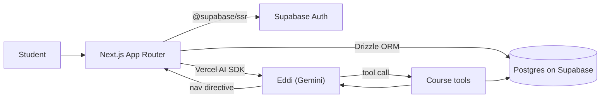

# WorldEd

> Learning platform with a Gemini agent for natural-language navigation, KaTeX-rendered math, and a streak system that brings students back daily.

[](https://nextjs.org)
[](https://www.typescriptlang.org)
[](https://supabase.com)
[](https://orm.drizzle.team)
[](https://tailwindcss.com)
[](https://ai.google.dev)


## ✨ Features
- **Talk-to-the-app navigation.** Type "open calculus" or "next module in linear algebra" and the Eddi agent routes you there via tool calls against the course catalog.
- **Math content that looks like math.** Modules render LaTeX through KaTeX, so derivations, integrals, and proofs read like a textbook.
- **Progress and streaks.** Per-course completion bars plus a daily-quiz streak counter, no notification spam.
- **Role-based access.** Student, mentor, and admin permissions enforced at the route layer and the database layer.
- **Type-safe end-to-end.** Drizzle ORM, Zod, and TypeScript strict mode catch schema breakage at build time, before a user ever sees it.

## 🏗 Architecture



Eddi runs a closed loop: the model picks a tool, the tool hits Drizzle, the result goes back to the model, and the model either replies or emits a route to push.

## 🛠 Stack

- **Frontend.** Next.js 15 (App Router, React Server Components, Turbopack), React 19, TypeScript strict
- **UI.** Tailwind v4, Radix primitives, shadcn-style components, Framer Motion, React Hook Form + Zod, Recharts, KaTeX
- **Backend.** Supabase (Auth, Postgres, Storage), Drizzle ORM, drizzle-kit migrations
- **AI.** Google Gemini via Vercel AI SDK (`@ai-sdk/google`, `ai`)
- **Email.** React Email templates rendered through Supabase

## 🚀 Getting started

```bash
git clone https://github.com/tabetant/worlded.git
cd worlded
npm install

cp .env.example .env
# Fill in DATABASE_URL, NEXT_PUBLIC_SUPABASE_URL,
# NEXT_PUBLIC_SUPABASE_ANON_KEY, GOOGLE_GENERATIVE_AI_API_KEY

# Apply migrations to your Supabase project
supabase db push   # or run SQL in supabase/migrations/ manually

npm run dev
```

Then open `http://localhost:3000`. You need a Supabase project and a Gemini API key from Google AI Studio.

## 📸 Demo

Live deployment: TBD (drop a URL here once it's redeployed).

## 👤 Author

**Antoine Tabet**, UofT Computer Engineering
[LinkedIn](https://linkedin.com/in/antoinetabetuoft) · [antoine.tabet@mail.utoronto.ca](mailto:antoine.tabet@mail.utoronto.ca) · [GitHub](https://github.com/tabetant)
